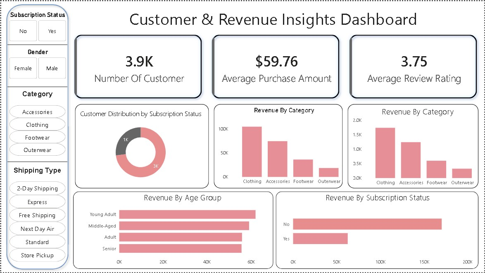

📊 Sales & Profit Analysis Dashboard

🔹 Dashboard Preview dashboard

🔹 Project Overview

In today’s competitive retail environment, businesses generate large volumes of sales data but often struggle to extract meaningful insights from it. This project focuses on analyzing retail sales data to uncover actionable insights related to revenue, profitability, and customer behavior.

The project demonstrates an end-to-end data analysis workflow using Python, SQL, and Power BI.

🔹 Business Problem

Retail businesses face several key challenges:

Lack of visibility into which products and regions drive the most revenue Difficulty in identifying loss-making products or categories Limited understanding of customer purchasing behavior Inefficient decision-making due to raw, unstructured data

Without proper analysis, businesses risk:

Revenue loss Poor inventory planning Missed growth opportunities

🔹 Solution Approach

To address these challenges, this project follows a structured data analysis pipeline:

Data Cleaning & Preparation Cleaned raw dataset using Python (Pandas) Handled missing values and inconsistencies Standardized data formats for accurate analysis

Data Analysis (EDA) Analyzed sales trends across regions and categories Identified high-performing and low-performing products Explored customer purchase patterns

SQL-Based Data Processing Used SQL queries for: Data extraction Aggregations Joins and filtering Improved efficiency in handling large datasets

Data Visualization (Power BI) Built an interactive dashboard to visualize: Sales performance Profit trends Regional analysis Category-wise insights

🔹 Key Insights Identified top-performing regions contributing the highest revenue Discovered categories generating high sales but low profit Highlighted customer segments with strong purchasing behavior Revealed trends that can help improve business strategy

🔹 Dashboard Features Interactive filters (Region, Category, Time) KPI cards for Sales, Profit, and Quantity Visual comparison of performance across segments User-friendly and dynamic layout

🔹 Tools & Technologies Python (Pandas) → Data cleaning & analysis SQL (MySQL) → Data querying & transformation Power BI → Data visualization & dashboard Excel/CSV → Data source

🔹 Conclusion

This project highlights how raw retail data can be transformed into meaningful business insights. By combining data analysis and visualization, it enables better decision-making and helps businesses optimize their performance.